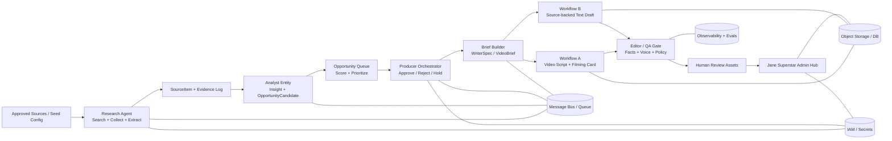

# Аналитический отчёт по SaaS API и open-source решениям для production-архитектуры Jane Superstar Content Factory

> Agent-first status: external research context.
> Canonical architecture lives in `docs/architecture/`.
> Durable implementation decisions extracted from this research must be recorded
> as ADRs in `docs/decisions/` or as runbooks in `docs/runbooks/`.
>
> Do not treat vendor/tool recommendations here as approved dependencies until
> an ADR or implementation task explicitly accepts them.

## Executive Summary

Для заданной архитектуры наиболее реалистична не «одна волшебная платформа», а модульная сборка из пяти слоёв: веб-исследование и extraction, reasoning/agent layer, durable orchestration и очереди, evaluation/QA, а также human-review/admin surface. При этом у вашей схемы есть жёсткое ограничение: поиск и сбор внешних данных должен жить только в **Research Agent**, а downstream-узлы должны работать лишь с уже собранными `SourceItem`, evidence log и structured handoff. Это автоматически отсекает многие “all-in-one AI workplace” решения как основной движок, но делает их полезными как оболочку для review/admin. В практическом production-режиме лучше всего выглядят две референсные сборки: **cloud-first** — `Tavily/SerpApi/Bright Data → OpenAI/Claude/Gemini → SQS/Kafka → Temporal Cloud/Step Functions → LangSmith/Braintrust/Content Safety → Coda/ClickUp + Retool/Power Apps`; и **self-host / hybrid** — `Crawl4AI/Playwright/Scrapy → LangGraph/Haystack/DSPy → NATS/Kafka → Temporal OSS/Kestra/Dagster → DeepEval/Ragas/Presidio → Directus/Strapi + Appsmith/ToolJet`. Эти сочетания закрывают почти все узлы, кроме producer decisioning, evidence-bounded briefing и Jane-specific editorial policy, которые почти наверняка потребуют собственной разработки. citeturn35search5turn34search8turn35search9turn32search0turn32search1turn32search2turn18search1turn4search1turn37search10turn12search0turn13search3

Сильнее всего рынок закрывает узлы **Research Agent**, **Producer Orchestrator** и **Jane Superstar Admin Hub**: там уже есть зрелые API, durable workflow engines, low-code internal app builders и review-friendly work-management surfaces. Слабее всего закрыты **Analyst Entity**, **Brief Builder** и **Editor / QA Gate** именно в вашем смысле — то есть как доменно-специфические ступени с жёсткими правилами traceability, доказательной границей, запретом на invented facts, single-platform lane и Jane-rubric enforcement. Даже очень сильные платформы для eval/observability вроде LangSmith, Braintrust или Arize дают tracing/evals, но не знают, что для вас значит “one thought / one emotion / one plot” и не умеют из коробки проводить границу между “insight” и “producer-approved production intent”. citeturn37search10turn12search0turn37search2turn37search17turn11search0turn12search3

Поэтому лучший практический вывод такой: **не пытаться купить готовую “content factory” целиком**. Лучше выбрать по одному сильному решению на слой, зафиксировать canonical contracts (`SourceItem`, `OpportunityCandidate`, `ProducerDecision`, `VideoBrief`/`ContentBrief`, `EditorialReviewResult`, `HumanReviewAsset`) и построить orchestration вокруг этих контрактов. Самые безопасные кандидаты на роль системообразующих платформ — Temporal/Step Functions для orchestration, Kafka/SQS/PubSub для событий, OpenAI/Anthropic/Gemini/Writer для structured generation, DeepEval/Ragas/Presidio плюс LangSmith/Braintrust для QA/observability, и Retool/Appsmith/ToolJet/Power Apps как admin shell. citeturn18search1turn4search1turn17search2turn32search0turn32search1turn32search2turn33search1turn25view0turn25view1turn25view3turn37search10turn12search0turn14search2turn30view2turn29view4turn13search3

## Архитектурные допущения и целевой поток данных

Ниже я принимаю как заданные ограничения из вашей спецификации: **Research Agent** — единственный слой поиска и data collection; **Workflow A/B** обрабатывают только заранее подготовленные артефакты; визуальные адаптеры, multi-platform repurposing, publisher/scheduler и auto-publish не входят в активный контур; целевой выход — **research-backed briefs, scripts, text drafts и editorially reviewed final assets** для ручного human review. В такой модели каждый downstream-узел обязан сохранять доказательную трассировку на уровне backend/JSON, но не обязан показывать её в user-facing output. Это важное архитектурное отличие: у вас не “content automation for distribution”, а “decisioned content production with auditability”. 

Нормальный production-поток тогда выглядит так: `Research Agent → canonical SourceItem / Evidence Log → Analyst Entity → Opportunity Queue → Producer Orchestrator → Brief Builder → Workflow A | Workflow B → Editor / QA Gate → Human Review Assets → Jane Superstar Admin Hub`. В operational terms это означает event-driven шину между узлами, idempotent processing на каждом переходе и жёсткую типизацию handoff-объектов. На практике это проще всего собрать либо через durable workflow engine (Temporal, Step Functions, Dagster, Prefect, Kestra), либо через hybrid-модель: message broker для событий + orchestrator для long-running stateful steps. citeturn18search1turn4search1turn18search2turn18search3turn19search3turn17search2turn17search0turn18search0

## Mapping по узлам

**Research Agent**

**Responsibilities / data flow.** Узел отвечает за discovery, crawl/scrape/extract, нормализацию внешних данных, проверку source policy и выпуск canonical `SourceItem` + evidence log. На входе — source config / allowlist / seed topics; на выходе — normalized text, metadata, engagement signals, raw payload и routing hint. Идеологически этот узел нельзя смешивать с analyst/writer/producer, иначе ломается traceability.

**Коммерческие API / SaaS кандидаты.**
- **entity["company","OpenAI","ai company"] Responses API** — хорош как research-tool layer, если вам нужен встроенный web/file search и structured outputs в одном API; минусы — выше vendor lock-in и не заменяет полноценный crawler; pricing: usage-based tokens + tool pricing. Документация и цены: citeturn32search0turn36search4  
- **entity["company","Tavily","search api vendor"] Search / Extract API** — сильный fit именно под AI-agent web research, credit model понятный, есть extract/search/usage API; минусы — это search-centric инструмент, а не полная web-data platform; pricing: free tier + PAYG + monthly credits. Документация и цены: citeturn35search5turn35search4  
- **entity["company","SerpApi","serp api vendor"]** — надёжен для SERP-level discovery, геопараметров и normalised search results; минусы — не покрывает full-page extraction как core capability; pricing: free tier и paid plans по объёму search throughput. Документация и цены: citeturn34search8turn34search0  
- **entity["company","Bright Data","proxy data platform"] Browser API** — полезен там, где обычный crawler ломается на JS-heavy страницах, anti-bot и сложных flows; минусы — это дороже и операционно тяжелее search API; pricing: pay-as-you-go по трафику/GB и enterprise plans. Документация и цены: citeturn35search9turn35search3  
- **entity["company","Diffbot","web extraction vendor"]** — хорош для article/product/company extraction и превращения web pages в structured data; минусы — меньше контроля, чем у low-level browser automation; pricing: free + paid plans, API-centric. Документация и цены: citeturn34search9turn34search1  
- **entity["company","Apify","web scraping platform"] Platform / API** — сильный fit, если нужны готовые Actors, managed runs и marketplace extractors; минусы — quality зависит от конкретного actor, а не только платформы; pricing model — usage/compute/actor-based, детальная калькуляция зависит от run profile. Документация: citeturn34search6turn34search14  

**Open-source кандидаты.**
- Crawl4AI — быстрорастущий; Apache-2.0; LLM-friendly crawl/extract в markdown/JSON, удобно ставить перед analyst layer. Репозиторий и docs: citeturn16search0turn16search4  
- Playwright — зрелый; Apache-2.0; лучший open-source вариант для browser automation, login flows и JS-rendered pages, но требует больше infra-операций. Репозиторий и docs: citeturn16search1turn16search17  
- Scrapy — очень зрелый; BSD-3-Clause; отличный baseline для controlled spiders, queues и pipelines, если extraction predictable. Репозиторий и docs: citeturn16search2turn16search14  
- Trafilatura — зрелый; open-source Python extractor; хорош для article text cleanup и metadata extraction после fetch/browser step. Репозиторий: citeturn16search3  

**Как собирать end-to-end.** Практический паттерн: discovery через Tavily/SerpApi, hard-page fetch через Bright Data или Playwright, extraction/cleanup через Diffbot или Trafilatura, затем canonicalization в `SourceItem`, evidence hashing, dedupe и запись в object store. Для compliance лучше ставить policy gate до long-running scrape jobs, а не после: это дешевле и уменьшает risk surface. Очередь между Research Agent и Analyst лучше делать асинхронной и idempotent, чтобы crawler retries не рождали дубли. citeturn35search5turn34search8turn35search9turn34search9turn16search1turn16search3turn17search2  

**Turnkey / gaps.** Ближе всего к turnkey здесь Apify и Bright Data; они закрывают discovery + extraction + managed execution. Но ваши уникальные gaps почти точно останутся кастомными: approved-source governance, “best-performing post selection”, evidence log schema, routing rules `workflow_a/workflow_b/drop`, и downstream-safe `SourceItem` contract.

**Analyst Entity**

**Responsibilities / data flow.** Узел должен преобразовывать source-backed material в insight layer: `SourceNote`, `InsightCard`, `ResearchHandoffRow`, `OpportunityCandidate`, risk flags и route suggestion. Он не должен писать итоговый пост и не должен сам принимать production priority.

**Коммерческие API / SaaS кандидаты.**
- OpenAI Responses API — сильный выбор для structured reasoning, tool use и stateful multi-turn analysis; минусы — дорогой deep reasoning при больших объёмах; pricing: pay-as-you-go. Документация и цены: citeturn32search0turn36search4  
- **entity["company","Anthropic","ai company"] Claude API** — очень силён для long-context reading, synthesis и cautious reasoning, что полезно для analytic handoff; минусы — enterprise governance надо продумывать отдельно; pricing: model-based token pricing. Документация и цены: citeturn32search1turn36search1  
- **entity["company","Google","technology company"] Gemini API** — хорошо подходит для agentic reasoning, long context и multimodal understanding; минусы — pricing and quotas зависят от Developer API vs Vertex setup; pricing: free tier + paid usage. Документация и цены: citeturn32search2turn38search5  
- **entity["company","Cohere","ai company"]** — хорош для enterprise-friendly text generation, rerank и compact classification/evaluation patterns; минусы — ecosystem вокруг agents уже, чем у OpenAI/Anthropic; pricing: token-based with eval vs production keys. Документация и цены: citeturn32search3turn36search2turn36search10  
- **entity["company","Mistral AI","ai company"]** — интересен как более cloud-agnostic европейский LLM provider; плюсы — API + SDK + quickstarts, good fit для self-host-minded teams; минусы — fewer native platform services around it; pricing: model/plan based. Документация и цены: citeturn33search4turn36search3  
- **entity["company","Writer","enterprise ai company"] API** — особенно хорош там, где analyst должен жестко держаться brand/voice/policy; минусы — меньше community/examples, чем у big-3 labs; pricing: public Palmyra model pricing + seat/enterprise plans. Документация и цены: citeturn33search1turn38search6turn38search2  
- **entity["company","Microsoft","technology company"] Azure OpenAI / AI Foundry** — удобен, если нужен enterprise landing zone, private networking и unified procurement; минусы — extra Azure integration overhead; pricing: pay-as-you-go and provisioned throughput. Документация и цены: citeturn32search16turn38search11turn38search14  

**Open-source кандидаты.**
- LangGraph — зрелый и production-oriented; по текущему экосистемному профилю это один из лучших OSS-кандидатов для stateful analyst agents, human-in-the-loop и graph-based control-flow. Репозиторий и docs: citeturn15search0turn15search12  
- Haystack — зрелый; Apache-2.0 по текущему стеку deepset; хорош для explicit pipelines, retrieval, routers и agent components. Репозиторий: citeturn15search1turn15search17  
- LlamaIndex — зрелый; ориентирован на data ingestion/query and agent workflows, полезен если analyst сильно завязан на document-centric reasoning. Репозиторий: citeturn15search2turn15search14  
- DSPy — быстрорастущий; declarative layer “programming, not prompting”, полезен для компилируемых rubric-driven analyst chains. Репозиторий и docs: citeturn31search0turn31search4  

**Как собирать end-to-end.** Самый здоровый паттерн тут — не один “умный prompt”, а typed pipeline: `SourceItem → extract evidence slices → analytic rubric scoring → OpportunityCandidate`. Внутри лучше разделять three outputs: `insight`, `reason`, `decision suggestion`. LLM-провайдер здесь должен быть stateless from business perspective, а истинным state owner должен быть аналитический сервис/DB. Так легче делать retries, audits и later model swaps. citeturn32search0turn32search1turn31search4turn15search12  

**Turnkey / gaps.** Writer, LangSmith-based prompt management и некоторые enterprise AI suites частично закрывают analyst workflow, но не закрывают вашу ключевую границу: analyst должен создавать opportunity, а не writer-ready output. Это почти наверняка кастомный слой.

**Opportunity Queue**

**Responsibilities / data flow.** Узел принимает `OpportunityCandidate`, присваивает score, priority hints, holds/rejects and routing suggestions и превращает поток research insights в управляемую backlog-очередь для producer review.

**Коммерческие API / SaaS кандидаты.**
- **entity["organization","Amazon Web Services","cloud provider"] Amazon SQS** — простой и дешёвый managed queue для decoupling; минус — это queue, а не event-stream/analytics backbone; pricing: pay-as-you-go. Официальная ссылка: citeturn6search0  
- Google Cloud Pub/Sub — хороший managed event bus для fan-out и replay patterns; минус — менее удобен, если хотите workflow semantics поверх очереди; pricing: usage-based. Официальная ссылка: citeturn5search0  
- Azure Service Bus — хороший выбор для enterprise queues/topics в Microsoft-heavy контуре; минус — weaker ecosystem than Kafka for event streaming analytics; pricing: tiered managed service. Официальная ссылка: citeturn5search1  
- **entity["company","Confluent","kafka vendor"] Cloud** — лучший коммерческий вариант, если очередь фактически должна быть event log + replay + stream processing; минусы — сложнее и дороже простого queue; pricing: usage-based cloud plans. Официальная ссылка: citeturn5search2  
- **entity["company","Upstash","serverless data vendor"] QStash** — хорош для lightweight HTTP/task queuing и serverless dispatch; минус — слабее как full event backbone; pricing: serverless usage-based. Официальная ссылка: citeturn5search3  
- **entity["company","CloudAMQP","managed rabbitmq vendor"]** — managed RabbitMQ без собственной эксплуатации кластера; минус — всё равно нужно думать про topology/acks/dead letters; pricing: plan-based managed service. Официальная ссылка: citeturn6search1  
- **entity["company","Redpanda Data","streaming vendor"] Cloud** — Kafka-compatible streaming с хорошим DX и performance; минус — имеет смысл, когда событий действительно много и нужен stream-native подход; pricing: cloud usage-based. Официальная ссылка: citeturn6search2  
- **entity["company","Ably","realtime platform vendor"]** — хорош для realtime status propagation в admin hub и review UI; минус — не заменяет durable business queue; pricing: usage-based realtime platform. Официальная ссылка: citeturn6search3  

**Open-source кандидаты.**
- RabbitMQ — очень зрелый broker; multi-protocol и удобен для work queues / retries / DLQ. Репозиторий: citeturn17search0turn17search4  
- NATS / JetStream — очень быстрый и лёгкий; хорош для internal eventing и simpler ops, чем Kafka в среднем случае. Репозиторий: citeturn18search0turn18search8  
- Apache Kafka — зрелый; Apache-2.0; лучший OSS baseline для event log, replay и scoring pipelines. Репозиторий и сайт: citeturn17search2turn17search14  
- Redis / Redis Streams — полезен как fast queue/cache/priority store, но требует дисциплины, чтобы не превратить его в “очередь на всё подряд”. Репозиторий: citeturn17search3turn17search19  

**Как собирать end-to-end.** Если очередь — просто backlog для producer review, обычно достаточно SQS/Service Bus/RabbitMQ + DB scoring table. Если нужен replay, delayed re-ranking, event history и analytics поверх очереди, лучше Kafka/Confluent/Redpanda. Отдельно рекомендую держать business-priority в базе, а не в брокере: брокер отвечает за delivery, а не за истинную ranking logic. citeturn17search2turn17search0turn6search0turn5search1  

**Turnkey / gaps.** У queue-слоя ready-made решений масса; кастомной останется именно ваша scoring formula, rule thresholds и explainability поля producer-facing UI.

**Producer Orchestrator**

**Responsibilities / data flow.** Узел принимает scored opportunities и создаёт `ProducerDecision`: approve/reject/hold, selected workflow, selected platform lane, priority, production intent и constraints. Это центр контуров управления, а не место для web search или конечной генерации.

**Коммерческие API / SaaS кандидаты.**
- **entity["company","Temporal Technologies","workflow vendor"] Temporal Cloud** — лучший fit для durable human-in-the-loop orchestration, retries, timers и deterministic stateful workflows; минус — требует осознанного engineering style, это не no-code игрушка; pricing: managed cloud. Документация и цены: citeturn18search1turn4search0  
- AWS Step Functions — очень силён, если нужен cloud-native orchestration на AWS; минус — developer ergonomics хуже, чем у Temporal, для сложных agentic loops; pricing: pay-per-state-transition. Документация и цены: citeturn4search1  
- **entity["company","Prefect","workflow vendor"] Cloud** — хороший компромисс между Python-centric UX и orchestration features; минус — не такой сильный durable-execution mental model, как у Temporal; pricing: cloud plans. Документация и цены: citeturn18search3turn4search2  
- **entity["company","Dagster Labs","workflow vendor"] Dagster+** — силён там, где важны lineage, software-defined assets и observable production graph; минус — чуть более data-platform than business-workflow feel; pricing: SaaS plans. Документация и цены: citeturn18search2turn4search3  
- n8n Cloud — удобен для быстро собрать workflow skeleton, integrations и webhook-based flows; минусы — при сложной бизнес-логике и revision loops быстро возникает “spaghetti canvas”; pricing: cloud plans. Документация и цены: citeturn19search6turn7search0  
- **entity["company","Workato","integration platform"]** — enterprise-grade integration/orchestration с governance и широкой коннекторной базой; минус — дорогой и менее developer-native; pricing: enterprise/custom. Официальная ссылка: citeturn7search1  
- **entity["company","Zapier","automation platform"]** — хорош для quick business automation и human notifications; минус — слаб как core durable orchestrator; pricing: task/plan-based. Официальная ссылка: citeturn7search2  
- **entity["company","Make","automation platform"]** — визуально удобен для integration-heavy flows и approval automations; минус — как главный orchestration brain подходит хуже, чем Temporal/Step Functions; pricing: operation-based plans. Официальная ссылка: citeturn7search3  

**Open-source кандидаты.**
- Temporal OSS — зрелый durable workflow engine для long-running processes и human approvals. Репозиторий: citeturn18search1  
- Dagster OSS — зрелый; Apache-2.0; полезен, если producer orchestration надо связывать с assets/lineage. Репозиторий: citeturn18search2  
- Prefect OSS — зрелый Python-first orchestration framework, особенно хорош для команд, где всё и так на Python. Репозиторий: citeturn18search3  
- Kestra — быстрорастущий event-driven orchestrator для YAML/API-first flows; хорош, если нужен self-host + event orientation. Репозиторий и сайт: citeturn19search3turn19search15  
- Apache Airflow — зрелый; классика для scheduled/data workflows, но менее natural fit для human decision loops. Репозиторий и сайт: citeturn19search0turn19search8  
- Argo Workflows — очень сильный выбор в Kubernetes-native окружении; хорош для containerized steps. Репозиторий и docs: citeturn19search1turn19search5  
- n8n OSS — fair-code; удобно как integration sidecar, но не лучший “single source of truth” для сложных producer policies. Репозиторий: citeturn19search2  

**Как собирать end-to-end.** Для вашей схемы я бы разделил orchestration на два уровня: **business state machine** в Temporal/Step Functions/Prefect и **integration glue** в n8n/Make/Zapier только для notifications, approvals, side effects и ticketing. ProducerDecision должен жить в durable store, а не только в workflow runtime memory. Иначе вы однажды обнаружите, что “approve” было, а объяснить почему — уже нет. citeturn18search1turn4search1turn19search6  

**Turnkey / gaps.** Turnkey почти закрывают n8n, Workato и Power Platform, но они плохо выражают ваш кастомный decision grammar: `approve/reject/hold`, one-lane choice, production intent и evidence-required constraints. Это лучше писать своим сервисом поверх оркестратора.

**Brief Builder**

**Responsibilities / data flow.** Узел превращает `ApprovedOpportunity` + evidence refs + voice/rubric constraints в `WriterSpec` или `VideoBrief`, сохраняя factual boundaries и запрещая visual/spec/publish noise.

**Коммерческие API / SaaS кандидаты.**
- OpenAI Responses API — отличный fit для строго структурированных brief objects в JSON schema; минусы — надо отдельно жёстко валидировать field completeness. Документация и цены: citeturn32search0turn36search4  
- Anthropic Claude API — хорош, когда нужен nuance-heavy brief synthesis из длинного контекста; минус — structured output discipline надо усиливать validation layer’ом. Документация и цены: citeturn32search1turn36search1  
- Google Gemini API — силён в multimodal/long-context brief assembly; минус — enterprise path через Vertex может добавить платформенной сложности. Документация и цены: citeturn32search2turn38search5  
- Writer API — сильный кандидат именно для brand-safe briefing и policy-aligned drafting instructions; минусы — более узкая ecosystem support. Документация и цены: citeturn33search1turn38search6  
- Azure OpenAI / AI Foundry — хорош, если brief builder должен жить в enterprise-compliant Azure perimeter и работать с provisioned throughput. Документация и цены: citeturn32search16turn38search11  
- Coda API — не LLM, но хороший persistence/output surface для самих briefs, approvals и linked references; минусы — это оболочка, а не reasoning engine; pricing: doc-maker seat plans. Документация и цены: citeturn10search4turn10search0  

**Open-source кандидаты.**
- Jinja — зрелый; BSD-3-Clause; простое и надёжное шаблонирование brief skeletons, особенно для deterministic `must_include/must_not_include`. Репозиторий и docs: citeturn21view3turn20search12  
- Pydantic — зрелый; MIT; must-have для schema validation, typed contracts и normalization of brief fields. Репозиторий: citeturn21view0turn22view2  
- Outlines — быстрорастущий; Apache-2.0; помогает добиваться реально structured generation на выходе LLM. Репозиторий и docs: citeturn22view0turn20search6  
- Guardrails — Apache-2.0; полезен для input/output guards и corrective re-asking при невалидном brief JSON. Репозиторий: citeturn22view1  

**Как собирать end-to-end.** Здоровый brief builder почти всегда двухступенчатый: сначала deterministic fill из `ProducerDecision` и evidence refs, затем LLM-enrichment в строго определённые поля, затем Pydantic/Outlines/Guardrails verification. Если делать наоборот — сначала “свободный LLM-бриф”, потом пытаться его починить — получается красивый, но ненадёжный хаос. citeturn21view3turn21view0turn22view0turn22view1  

**Turnkey / gaps.** Здесь рынок закрывает только отдельные части. Именно разделение на `production_intent`, `factual_boundaries`, `opening_direction`, `must_not_include` и `selected_platform` придётся реализовывать кастомно.

**Workflow A / Workflow B**

**Responsibilities / data flow.** Оба workflow должны стартовать **не** от raw research, а от structured brief. Workflow A производит video-native assets — hook, script, filming card; Workflow B — один source-backed text asset на выбранную платформу. Multi-platform expansion и publish queue здесь запрещены.

**Коммерческие API / SaaS кандидаты.**
- OpenAI Responses API — универсальный базовый движок для draft/script generation, function calling и revision loops. Документация и цены: citeturn32search0turn36search4  
- Anthropic Claude API — особенно хорош для script drafting, nuanced editing и longer-form narrative flow. Документация и цены: citeturn32search1turn36search1  
- Google Gemini API — сильный кандидат, если нужны multimodal context ingestion и agentic reformulations. Документация и цены: citeturn32search2turn38search5  
- Cohere — хороший business-friendly text engine и rerank companion, особенно если drafting and ranking надо держать в одном vendor family. Документация и цены: citeturn32search15turn36search2  
- Mistral AI API — подходит как model-choice для cost-aware drafting layers и hybrid/self-host-friendly stacks. Документация и цены: citeturn33search4turn36search3  
- Writer API — useful, если workflow output должен быть максимально on-brand и policy-safe в enterprise copy setting. Документация и цены: citeturn33search1turn38search6  
- Azure OpenAI / Foundry — good fit for enterprise throughput, compliance and internal networking around content generation. Документация и цены: citeturn32search16turn38search11  

**Open-source кандидаты.**
- Hugging Face Transformers — очень зрелый baseline для self-hosted generation/classification/reranking stacks. Репозиторий: citeturn23search0  
- vLLM — быстрорастущий; high-throughput engine для serving open models, если хотите уводить drafting с SaaS на собственный inference layer. Репозиторий и docs: citeturn23search1turn23search13  
- Ollama — удобен для local/hybrid experimentation и low-friction self-host runs, но не стоит делать его единственным prod runtime без perimeter hardening. Репозиторий и сайт: citeturn23search2turn23search6  
- NeMo Guardrails — open-source toolkit для programmable guardrails над conversational systems; полезен как outer control layer вокруг generation. Репозиторий: citeturn23search3turn23search11  

**Как собирать end-to-end.** Практически лучше развести runtime на два path’а: “generation” и “post-generation refinement”. Для Workflow A полезен dedicated script template + hook selection pass + filming card formatter. Для Workflow B полезен draft → self-edit → editor gate. В обоих случаях храните только один canonical asset per decision, а не array platform variants; иначе producer contract теряет смысл. citeturn32search0turn32search1turn23search1turn23search3  

**Turnkey / gaps.** Многие LLM APIs отлично закрывают generation, но ваш real gap — управляющие правила: no generic intros, no unsupported claims, one-lane only, no standalone CTA question, LinkedIn-English special rule при selected platform. Это опять кастомный policy layer.

**Editor / QA Gate**

**Responsibilities / data flow.** Узел валидирует факты, voice, style, banned patterns, evidence coverage и принимает решение `approved_for_human_review / needs_revision / rejected`. Ваша логика review должна быть не просто moderation, а editorial quality control.

**Коммерческие API / SaaS кандидаты.**
- **entity["company","LangChain","ai tooling company"] LangSmith** — хороший production choice для traces, evals, prompt/version comparisons и deployment monitoring; минус — не заменяет custom editorial rubric. Документация и цены: citeturn37search10turn37search14  
- Braintrust — сильный eval/observability слой с production focus; минус — как и все eval platforms, требует ваших собственных criteria and testsets. Документация и цены: citeturn12search8turn12search0  
- **entity["company","Humanloop","ai ops vendor"]** — полезен для prompt management/evaluation loops и collaborative iteration; минус — public pricing/detail level ограничены. Официальная ссылка: citeturn11search2  
- **entity["company","Lakera","ai security vendor"] Guard** — хорош для runtime prompt-security и policy filtering; минус — это security guardrail, не полноформатный editorial QA. Описание и цены: citeturn11search25turn11search3  
- **entity["company","Arize AI","observability vendor"] AX / Phoenix cloud** — силён в observability + evals; минус — опять же нужен собственный rubric layer. Официальные ссылки: citeturn37search9turn37search2  
- **entity["company","Patronus AI","ai evaluation vendor"]** — покрывает test suite generation, realtime LLM evaluation и hallucination/security evaluators; минус — меньше ecosystem fit для non-LLM QA. Описание: citeturn37search1turn37search12  
- Azure AI Content Safety — хороший managed safety API в Microsoft-контуре; минус — safety ≠ full editorial review. Официальная ссылка: citeturn3search2  
- Vertex AI evaluation / Agent Platform — полезен, если quality stack уже строится на Google; минус — удобно прежде всего в Google-native estate. Официальные ссылки: citeturn38search1turn38search9  

**Open-source кандидаты.**
- DeepEval — быстрорастущий; Apache-2.0; сильный OSS-кандидат для LLM-as-a-judge, hallucination/task metrics и regression tests. Репозиторий: citeturn25view0  
- Ragas — зрелый; Apache-2.0; особенно полезен для retrieval-grounded quality checks и synthetic eval datasets. Репозиторий и docs: citeturn25view1turn24search17  
- Presidio — зрелый; MIT; отличный open-source слой для PII detection/redaction, но не заменяет style/voice QA. Репозиторий и docs: citeturn25view3turn24search7  
- Giskard OSS / Checks — хороший OSS-инструмент для agent testing, groundedness, conformity и safety checks; важно помнить, что текущая v3 ещё модульно созревает. Репозиторий: citeturn25view2  

**Как собирать end-to-end.** Лучший паттерн здесь — сочетать три класса проверок: deterministic rules (regex/schema/banned intros), semantic evals (DeepEval/Ragas/Giskard), и runtime tracing/monitoring (LangSmith/Braintrust/Arize). Делать ставку только на moderation API — плохая идея: moderation ловит “плохое” содержимое, но почти не ловит “слабый, generic, не-jane-овый текст”. citeturn25view0turn25view1turn25view3turn37search10turn12search0turn37search2  

**Turnkey / gaps.** Несмотря на богатый рынок evals, ваш самый ценный актив здесь — собственная editorial scorecard: rubric fit, opening strength, evidence integrity, no generic AI-style, one thought/one emotion/one plot. Это кастомизация, а не покупка.

**Human Review Assets**

**Responsibilities / data flow.** Узел хранит и показывает final text assets, video scripts, filming cards, revision notes и approval status без scheduling/publishing. Это уже не детище workflow engine, а review-oriented collaboration surface.

**Коммерческие API / SaaS кандидаты.**
- **entity["company","Coda","productivity software company"]** — хорошо подходит как structured doc/database review workspace с API; минус — не полноценный admin shell. Документация и цены: citeturn10search4turn10search0  
- **entity["company","ClickUp","productivity software company"]** — полезен для review tasks, statuses, comments и API/webhooks; минус — content objects живут как work items, а не истинные domain entities. Документация и цены: citeturn10search5turn10search1turn10search13  
- **entity["company","Asana","productivity software company"]** — strong review/project surface с понятным status management; минус — richer content data model often needs external DB. Документация и цены: citeturn10search2turn10search14  
- **entity["company","monday.com","work management company"]** — удобен для review pipelines, board-level visibility и APIs; минус — domain modelling быстро уходит в custom board design. Документация и цены: citeturn10search3turn10search7  
- Directus Cloud — хороший fit, если human review assets должны быть first-class content entities с API, files и roles; минус — потребует UI/front layer поверх build-in studio для лучшего editing UX. Документация и цены: citeturn26search4turn13search5  
- Supabase — полезен как storage/auth/functions backbone для review asset service; минус — сам по себе не review UI. Цены: citeturn13search0turn13search7  

**Open-source кандидаты.**
- Strapi — зрелый OSS headless CMS для content assets и editorial metadata; хорош, если нужен editor-friendly backend. Репозиторий: citeturn29view1turn26search1  
- Directus — гибкий backend/app dashboard для SQL-backed content and files; важно учесть, что текущая лицензия и её эволюция требуют внимания. Репозиторий и docs: citeturn29view0turn26search4  
- NocoDB — быстрорастущий; Sustainable Use License; удобен как self-hosted table interface for backlog/review records. Репозиторий: citeturn29view3  
- Outline — BSL 1.1; хороший self-hosted knowledge/review/wiki layer, если asset review ближе к document collaboration. Репозиторий: citeturn29view6turn30view1  

**Как собирать end-to-end.** Если review — это mostly workflow statuses и comments, Coda/ClickUp/Asana/monday.com достаточно быстро дают результат. Если review assets — ключевая часть вашей IP и later-admin logic, лучше делать их first-class objects в Directus/Supabase/Postgres и уже поверх этого строить UI. Иначе human review surface начинает диктовать вам schema, вместо того чтобы читать её. citeturn10search4turn10search5turn10search2turn10search3turn29view0turn13search0  

**Turnkey / gaps.** На рынке много готовых review surfaces, но почти нет готовых именно под ваш объект `HumanReviewAsset` с evidence refs, editor score и one-platform logic. Это обычно свой data model.

**Jane Superstar Admin Hub**

**Responsibilities / data flow.** Это операционный интерфейс, который должен показывать Research Monitor, Opportunity Queue, Producer Decisions, Workflow A/B assets и Human Review Status, но не scheduler/publisher.

**Коммерческие API / SaaS кандидаты.**
- **entity["company","Retool","internal tools vendor"]** — один из сильнейших вариантов для internal admin hub поверх APIs/DB/LLMs; минусы — pricing и governance лучше уже на mid-late stage. Документация: citeturn14search2turn14search10  
- **entity["company","Appsmith","low-code company"] Cloud** — хороший low-code builder с AI/workflow emphasis и понятной self-host path; pricing: free + per-user business. Документация и цены: citeturn14search12turn9search0  
- **entity["company","ToolJet","low-code company"] Cloud** — strong fit для internal apps, workflows и AI agents; pricing builder-based, а не end-user based, что часто выгодно для ops hubs. Документация и цены: citeturn29view4turn9search1  
- **entity["company","Budibase","low-code company"] Cloud** — хорош, если хотите internal ops hub + forms + automations + apps на одном контуре; pricing: creator/action-based cloud plans. Документация и цены: citeturn29view5turn9search2  
- **entity["company","Directus","headless backend company"] Cloud** — закрывает backend + studio + auth роль, если hub ближе к “backend for content ops” than classic internal app; pricing: from public cloud plans. Документация и цены: citeturn26search4turn13search5  
- **entity["company","Supabase","backend platform company"]** — удобен как auth/db/functions/realtime backbone под custom admin hub; pricing: free + project-based paid plans. Цены и docs: citeturn13search0turn13search7  
- **entity["company","Hasura","graphql platform company"] Cloud** — хороший GraphQL/API layer для admin hub, если frontend строится отдельно; pricing: free/pro/payg/enterprise. Официальные ссылки: citeturn13search1turn13search4  
- Microsoft Power Apps — очень сильный enterprise admin option в Microsoft ecosystem, особенно с Dataverse/SSO; минус — может оказаться тяжёлым и дорогим для early-stage content factory. Цены: citeturn13search3turn13search6  

**Open-source кандидаты.**
- Appsmith OSS — зрелый; Apache-2.0; хороший default для CRUD-heavy admin panels и dashboards. Репозиторий: citeturn30view2  
- ToolJet OSS — AGPL-3.0; силён для internal tools + workflows + AI-assisted admins. Репозиторий: citeturn29view4  
- Budibase OSS — open-source/open-core mix (GPLv3/MPL/BSL depending on component); хорош для ops apps, forms and workflows. Репозиторий: citeturn30view4  
- React-admin — зрелый; MIT; лучший вариант, если команда готова писать собственный React frontend и хочет полный контроль над data providers. Репозиторий: citeturn29view7turn30view0  
- Directus OSS/source-available — хорош как admin/data plane, если hub строится вокруг SQL + asset management. Репозиторий: citeturn29view0  

**Как собирать end-to-end.** Если важна скорость — делайте Admin Hub на Retool/Appsmith/ToolJet поверх PostgreSQL/Directus/Supabase. Если важен долгий срок жизни продукта и тонкий UX, лучше React-admin/Next.js поверх typed API. Главное — не смешивать admin hub с orchestration logic: UI должен читать и отправлять команды, а не быть единственным местом, где существует бизнес-состояние. Это классическая архитектурная ловушка: “таблица стала системой”. Никогда не смешивайте это. citeturn14search2turn30view2turn29view4turn29view7turn13search0turn29view0  

**Turnkey / gaps.** Здесь как раз много turnkey. Но даже самый хороший admin builder не даст вам из коробки domain object model `OpportunityCandidate → ProducerDecision → HumanReviewAsset`; это надо спроектировать отдельно.

## Паттерны интеграции end-to-end

Рекомендуемая техническая композиция такова. Для событий — Kafka/Confluent или SQS/PubSub/Service Bus, в зависимости от того, нужен ли replayable event log или достаточно work queue. Для orchestration — Temporal/Step Functions/Prefect/Dagster. Для core domain state — PostgreSQL или совместимая транзакционная БД. Для больших сырьевых артефактов — object storage. Для typed contracts — Pydantic schemas, schema-versioning и explicit migration rules. Для audit trail — immutable evidence refs и trace IDs, которые проходят сквозь все узлы. Для observability — OpenTelemetry-friendly trace/eval stack вроде LangSmith, Braintrust или Arize плюс внутренние domain metrics. citeturn17search2turn6search0turn5search0turn5search1turn18search1turn4search1turn18search3turn18search2turn37search10turn12search0turn37search9

По аутентификации и секретам хороший pattern такой: machine-to-machine auth через service accounts/OIDC/JWT, секреты в cloud secret manager или equivalent, RBAC на уровне admin hub и row-level policy для review assets. Отдельно советую держать два permission domains: **production control** и **editorial review**. Producer и operator не обязательно должны совпадать с человеком, который может менять финальный текст; иначе audit станет недоказуемым. Для внешних API лучше использовать per-node scoped credentials: research credentials не должны иметь доступ к admin surface, а admin surface не должен иметь право инициировать arbitrary web search.  

По обработке ошибок лучше не надеяться на “LLM сам поправится”. Нужен стандартный error contract: `transient_error`, `policy_block`, `evidence_missing`, `schema_invalid`, `qa_failed`, `human_override_required`. Для retries используйте exponential backoff только на transport и vendor outages; для semantic failures — explicit remediation path, а не blind retry. Для long-running flows полезны dead-letter queues, stuck-run detectors и “hold” state в producer. И да, human-in-the-loop — это не баг, а фича: у вас production system с judgment boundaries. Штука почти монашеская — просветления без дисциплины не бывает. citeturn18search1turn17search0turn17search2turn37search10turn11search25

## Платформы, которые покрывают несколько узлов сразу

Если цель — купить максимум готового, а не строить с нуля, я бы смотрел на несколько классов multi-node platforms.

Первый класс — **integration/orchestration suites**: n8n, Workato, Make, Zapier, Power Platform. Они лучше всего покрывают Opportunity Queue, Producer Orchestrator-side automations, часть Human Review Assets и Admin Hub glue. Но они не должны становиться core analyst/brief/editor logic. Иначе policies and typed domain contracts растворяются в визуальных canvas. citeturn19search6turn7search1turn7search3turn7search2turn13search3

Второй класс — **LLM engineering / eval platforms**: LangSmith, Braintrust, Humanloop, Arize, Patronus. Они неплохо закрывают куски Analyst Entity, Workflow A/B observability и Editor/QA Gate. Но они практически никогда не закрывают ваш ProducerDecision semantics, platform-lane policy и HumanReviewAsset domain model without custom code. citeturn37search10turn12search0turn11search2turn37search9turn37search1

Третий класс — **low-code internal app / backend platforms**: Retool, Appsmith, ToolJet, Budibase, Directus, Supabase, Hasura. Они закрывают Jane Superstar Admin Hub и часть Human Review Assets особенно хорошо, а некоторые — ещё и workflow/automation слои. Но они не заменяют durable orchestration, если у вас есть revision loops, event retries, human holds и cross-node contracts. citeturn14search2turn9search0turn9search1turn9search2turn13search5turn13search0turn13search1

Если резюмировать practically:  
- **Минимум custom ops, максимум скорости**: n8n Cloud + OpenAI/Claude + LangSmith + Coda/ClickUp + Retool.  
- **Enterprise-safe и объяснимый production path**: Azure/OpenAI or Gemini/Vertex + Kafka/SQS + Temporal/Step Functions + Braintrust/LangSmith + Power Apps/Retool.  
- **Наиболее независимая self-host сборка**: Crawl4AI + Playwright + LangGraph/Haystack + Kafka/NATS + Temporal OSS/Kestra + DeepEval/Ragas/Presidio + Directus/Appsmith/ToolJet. citeturn19search6turn32search0turn32search1turn37search10turn10search4turn14search2turn38search11turn38search1turn18search1turn25view0turn16search0turn16search1turn15search1turn18search0turn29view0turn30view2turn29view4  

## Сравнительная матрица рекомендаций

| Узел | Предпочтительный SaaS/API | Предпочтительный OSS | Что я бы рекомендовал первым |
|---|---|---|---|
| Research Agent | Tavily + Bright Data + SerpApi + Diffbot citeturn35search5turn35search9turn34search8turn34search9 | Crawl4AI + Playwright + Scrapy + Trafilatura citeturn16search0turn16search1turn16search2turn16search3 | Начать с Tavily/SerpApi для discovery и Playwright/Bright Data только для трудных страниц |
| Analyst Entity | OpenAI / Claude / Gemini / Writer citeturn32search0turn32search1turn32search2turn33search1 | LangGraph + Haystack + LlamaIndex + DSPy citeturn15search0turn15search1turn15search2turn31search0 | LangGraph/Haystack поверх одного коммерческого LLM |
| Opportunity Queue | SQS / PubSub / Service Bus / Confluent Cloud citeturn6search0turn5search0turn5search1turn5search2 | Kafka + RabbitMQ + NATS + Redis Streams citeturn17search2turn17search0turn18search0turn17search3 | Если сомневаетесь — SQS/RabbitMQ; если нужен replay и analytics — Kafka |
| Producer Orchestrator | Temporal Cloud / Step Functions / Prefect Cloud / Dagster+ citeturn4search0turn4search1turn4search2turn4search3 | Temporal OSS + Kestra + Prefect OSS + Dagster OSS citeturn18search1turn19search3turn18search3turn18search2 | Temporal first, n8n only as sidecar for integrations |
| Brief Builder | OpenAI / Claude / Gemini + Coda for persistence citeturn32search0turn32search1turn32search2turn10search4 | Jinja + Pydantic + Outlines + Guardrails citeturn21view3turn21view0turn22view0turn22view1 | Deterministic skeleton first, LLM enrichment second |
| Workflow A/B | OpenAI / Claude / Gemini / Writer / Mistral citeturn32search0turn32search1turn32search2turn33search1turn33search4 | Transformers + vLLM + Ollama + NeMo Guardrails citeturn23search0turn23search1turn23search2turn23search3 | Один canonical asset на decision; без platform variants |
| Editor / QA Gate | LangSmith / Braintrust / Arize / Patronus / Lakera citeturn37search10turn12search0turn37search9turn37search1turn11search25 | DeepEval + Ragas + Presidio + Giskard citeturn25view0turn25view1turn25view3turn25view2 | Сочетать deterministic checks и semantic evals |
| Human Review Assets | Coda / ClickUp / Asana / monday.com / Directus Cloud citeturn10search4turn10search5turn10search2turn10search3turn26search4 | Strapi + Directus + NocoDB + Outline citeturn29view1turn29view0turn29view3turn29view6 | Если review — core IP, хранить assets в собственной БД/API |
| Jane Superstar Admin Hub | Retool / Appsmith Cloud / ToolJet Cloud / Budibase / Power Apps citeturn14search2turn9search0turn9search1turn9search2turn13search3 | Appsmith OSS + ToolJet OSS + Budibase OSS + React-admin citeturn30view2turn29view4turn30view4turn29view7 | Для скорости — Appsmith/ToolJet; для кастомного UX — React-admin |

## Пробелы, где почти наверняка нужен собственный код

Самый большой пробел — **semantic contracts** между узлами. Рынок продаёт search, extraction, LLMs, queues, workflow runners, evals и admin builders. Но почти никто не продаёт ровно ваш домен: `OpportunityCandidate`, `ProducerDecision`, `ApprovedOpportunity`, `WriterSpec/VideoBrief`, `EditorialReviewResult`, `HumanReviewAsset`. Это и есть настоящий продуктовый слой. Без него SaaS-инструменты останутся просто набором очень дорогих клавиш.  

Второй пробел — **Jane-specific policy engine**. Сюда входят voice rules, banned patterns, opening quality rules, factual boundaries, single-platform lane, “no standalone CTA question”, LinkedIn-English exception, one-thought/one-emotion/one-plot logic и producer-vs-analyst responsibility split. Этого нет из коробки ни в LangSmith, ни в Braintrust, ни в Power Apps, ни в Workato. Есть только общие примитивы, на которых это можно построить. citeturn37search10turn12search0turn13search3turn7search1  

Третий пробел — **evidence-bound editorial control**. Вам нужен не просто trace, а возможность доказать, из каких источников построен бриф, какие поля допустимо было обобщать, а какие нет, и какие factual claims были запрещены для восстановления/домысливания. Это ближе к regulated content pipeline, чем к обычной content automation; поэтому рекомендую хранить evidence refs и derived claims как отдельные structured objects, а не как длинные markdown-приложения.  

Четвёртый пробел — **human review ergonomics**. Любая low-code/admin платформа даст таблицу, форму, комментарии и кнопки approve/reject. Но чтобы человеческий редактор реально работал быстро, обычно нужны кастомные diff views, side-by-side evidence view, failed-check explanations, one-click revision requests и provenance preview. Это почти всегда custom UI поверх стандартного data layer.  

Пятое ограничение самого исследования: официальные материалы по большинству платформ англоязычные; русскоязычные официальные источники встречаются редко. Там, где pricing на официальных страницах скрыт за calculator/sales flow, я сознательно указывал **модель тарификации**, а не пытался пересказывать полные ценовые таблицы. Цены на AI API и managed orchestration особенно часто меняются, поэтому финальную закупку стоит сверять уже по актуальным pricing calculators у конкретных вендоров. citeturn36search4turn36search1turn38search5turn38search11turn4search0turn7search1

Итоговая рекомендация в одном абзаце: если бы мне нужно было запускать такую фабрику в production без заданного бюджета и без привязки к облаку, я бы выбрал **Temporal как orchestration spine, Kafka или SQS как event layer, OpenAI/Claude/Gemini как primary reasoning/generation providers, Pydantic+Outlines+Guardrails как contract/brief layer, DeepEval+Ragas+LangSmith как QA loop, и Appsmith/ToolJet/Retool поверх Directus/Supabase как Jane Superstar Admin Hub**. Всё, что касается role boundaries, evidence grammar и editorial policy, я бы сразу отнёс в custom codebase — потому что именно там и находится ваш реальный moat. citeturn18search1turn17search2turn6search0turn32search0turn32search1turn32search2turn21view0turn22view0turn22view1turn25view0turn25view1turn37search10turn30view2turn29view4turn14search2turn29view0turn13search0
